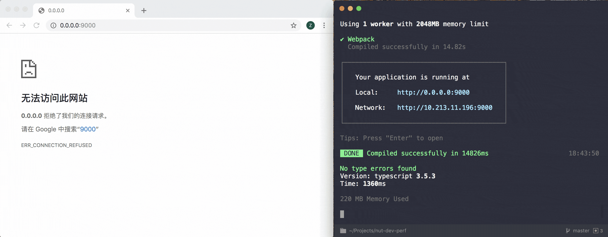

# nut-dev-perf

## Get started

```bash
# 安装依赖
yarn

# 创建 2000 个 todomvc 页面
# 具体数量可自行修改 scripts/create-many-pages.js
yarn create-pages

# 普通开发模式
yarn dev

# 极速开发模式
yarn dev:speed
```

## 对比

普通开发模式构建 2000 个 todomvc 页面


极速开发模式


## 总结

极速开发模式体验和正常模式基本一致，只是会多一步动态构建，而且对电脑的性能要求极低，占用的初始内存也会小很多



PS：动态构建过程中，页面可以做到无刷新切换，开发体验和普通的开发模式一致 😉
